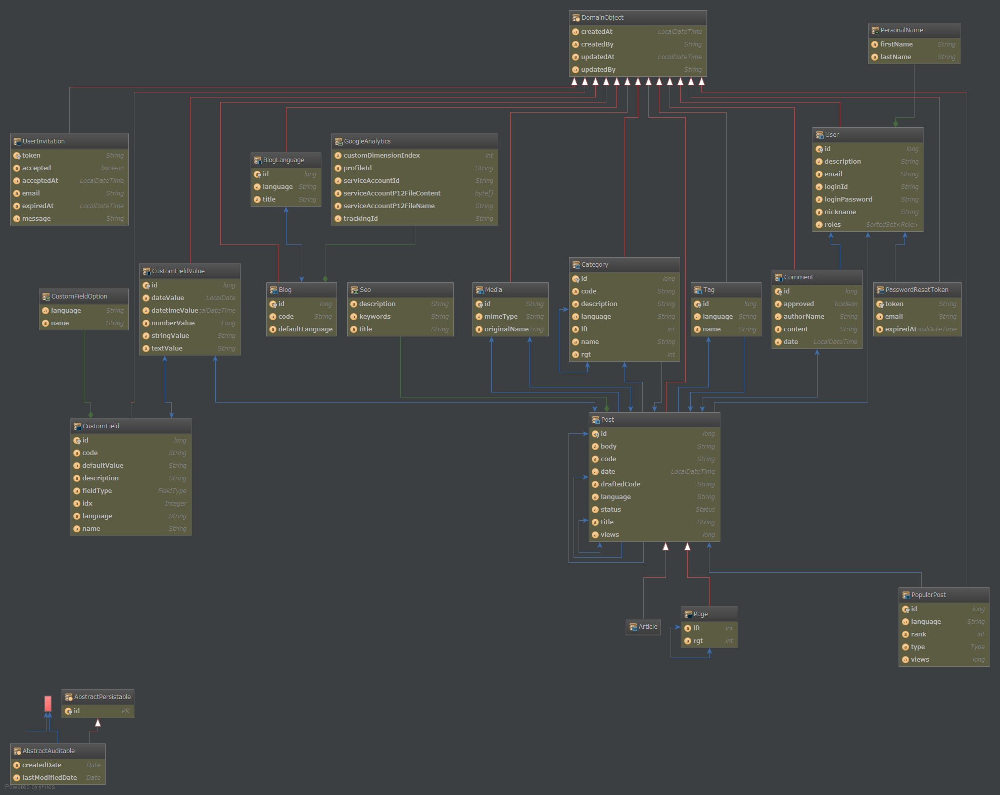

1 Intro
=====

1.1 What is WallRide?
---------------------
WallRide is a multilingual easy-to-customize open source CMS made by
Java, using [Spring Framework](http://projects.spring.io/spring-framework/), [Hibernate](http://hibernate.org/) and [Thymeleaf](http://www.thymeleaf.org/).  
WallRide focuses on sophisticated UI, simple and clean source code and
easy deploy to AWS BeansTalk(of course other servlet containers)  
We hope this CMS is loved by many developers of principles all over the world.

1.2 What is the strong point?
---------------------
1. Multilingual CMS.
You can manage 
 
2. Full-text search.
WallRide 

3. Affinity for AWS.


2 Getting started
===============

WallRide has 2 packaging types; jar and war.

2.1 Installation requirements
-----------------------------
- Java8 or higher
- Database (MySQL or PostgreSQL)

<a name="preparation">2.2 Preparation</a>
---------------
1. Create database for WallRide

2. Create wallride.home

```bash
mkdir <WALLRIDE_HOME>
mkdir <WALLRIDE_HOME>/config
cp wallride-core/src/main/resources/application.properties <WALLRIDE_HOME>/config
```
3. Set application.properties

Configure these properties in application.properties according to your environment. 

- spring.datasource.url
- spring.datasource.username
- spring.datasource.password
- spring.mail.host
- spring.mail.port
- spring.mail.default-encoding

2.3 Run Executable jar
---------------------
What you need to do:

1. Download the latest jar files from the link below. \[link\]
  
2. Execute command
  
```bash
cd wallride-bootstrap
mvn spring-boot:run -P jar -Drun.jvmArguments=-Dwallride.home=file:<WALLRIDE_HOME>/
```
  
3. Access URL below
  
http://localhost:8080/_admin/setup

4. See [4.1 Setup](#setup)

2.4 Run War + Tomcat
---------------------
What you need to do:

1. Download the latest war file from the link below.  \[link\]
  
2. Configure context in Tomcat
  
3. Modify Tomcat’s server.xml to handle internationalized characters correctly

4. Fix memory and mail handling settings in Tomcat
  
5. Start Tomcat

```bash

```

6. See [4.1 setup](#setup)

2.5 Run AWS Elastic Beanstalk
---------------------
1. Download the latest war file from the link below.  
\[link\]

2. Create wallride.home in S3  
 
Create S3 bucket and create a directory for wallride.home in it. (See [2.2 Preparation](#preparation))

3. Create application.properties in S3
 
Configure items below in application.properties 
And set the value of jgroups 

- jgroups.configurationFile=jgroups-ec2.xml
- jgroups.s3.bucket={your-s3-bucket-name}
   
4. Setup AWS Elastic Beanstalk  
5. Configure AWS Elastic Beanstalk  
6. Upload war  
7. See [4.1 Setup](#setup)
 
3 WallRide Home Directory
=======================
 
```text
wallride_home
+-- config
|   +-- application.properties
+-- media
+-- themes
    +-- default
       +-- resources
       |   +-- images
       |   |   +-- background.jpg
       |   +-- scripts
       |   +-- styles
       +-- templates
           +-- article
           |   +-- author.html
           |   +-- category.html
           |   +-- describe.html
           |   +-- index.html
           +-- error
           +-- page
           |   +-- describe.html
           +-- tag
           |   +-- index.html
           |   +-- post.html
           +-- user
           |   +-- login.html
           |   +-- password-reset1-entry.html...
           +-- google-analytics.html
           +-- index.html
           +-- layout.html
```
 
4 User guide
===============
<a name="setup">4.1 Setup</a>
-----------


 
5 Designer guide
==============
 
5.1 Customize themes
----------------
 
WallRide has original themes for the guest site in it, but you can replace them by putting your sources in wallride.home. 
 
1. HTML
 
WallRide's template engine is thymeleaf. If you extend it, please refer to [Thymeleaf documentation](http://www.thymeleaf.org/documentation.html) as well.

| URL                           |      outline                                           |  directory path        |
|-------------------------------|--------------------------------------------------------|------------------------|
| /                             | Index template                                         | /index.html            |
| /{language}/yyyy/mm/dd/{code} | Article description template                           | /article/describe.html |
| /category/{categoryCode}      | Article index template grouped by the category         | /article/category.html |
| /author/{authorId}            | Article index template grouped by the author           | /article/author.html   |
| /tag/                         | Tag index template                                     | /tag/index.html        |
| /tag/{tagName}                | Article index template grouped by the tag              | /article/index.html    |
| /search                       | Post search template                                   | /search.html           |
| /{pageCode}                   | Page template(index and description template are same) | /page/describe.html    |
 

WallRide customizable variables … choto matte kudasai.
 
2. Resources

Place resource files under "resources" directory in wallride.home. You can refer them from html like this;

```html
<link rel="stylesheet" th:href="@{/resources/css/sticky-footer-navbar.css}" href="#" />
<script th:src="@{/resources/lib/jquery.lazyload.min.js}" src="#"></script>

```
 
6 Developer guide
===============
 
6.1 Overall architecture
--------------------
WallRide uses Spring Framework, Hibernate, and Thymeleaf.

6.2 Customize
---------
Thanks to [Spring Boot starters](http://projects.spring.io/spring-boot/) which WallRide uses and customizes, it is very easy to customize it.

1. Write pom.xml

```xml
<project xmlns="http://maven.apache.org/POM/4.0.0" xmlns:xsi="http://www.w3.org/2001/XMLSchema-instance"
		 xsi:schemaLocation="http://maven.apache.org/POM/4.0.0 http://maven.apache.org/xsd/maven-4.0.0.xsd">
	<modelVersion>4.0.0</modelVersion>
	<parent>
		<groupId>org.wallride</groupId>
		<artifactId>wallride-parent</artifactId>
		<version>1.0.0.M8</version>
	</parent>
	<groupId>com.example</groupId>
	<artifactId>example-blog</artifactId>
	<version>1.0.0.RELEASE</version>
	<packaging>jar</packaging>

	<properties>
		<start-class>com.example.Application</start-class>
	</properties>

	<dependencies>
		<!-- MySQL Driver -->
		<dependency>
			<groupId>mysql</groupId>
			<artifactId>mysql-connector-java</artifactId>
			<version>5.1.23</version>
		</dependency>
	</dependencies>
</project>
```

2. Create main class with @SpringBootApplication 

```java
@SpringBootApplication
public class Application extends SpringBootServletInitializer  {

	public static void main(String[] args) {
		SpringApplication.run(Application.class, args);
	}
}
```

That's it! Preparation is done, now you can start customize. 

3. In case of adding URL
```java
@SpringBootApplication
public class Application extends SpringBootServletInitializer  {

	public static void main(String[] args) {
		SpringApplication.run(Application.class, args);
	}
}
```

4. Override existing Controller 
5. In case of adding Service
6. In case of adding Entities

Entities
--------
ER diagram

[](../assets/images/er-diagram.png)

About HA
--------
WallRide is infinispanを使ったHA構成を実現してるよ 
For more Details: chotto matte kudasai

7 What’s next
=============
WallRide is still milestone but working hard for Release version!
Of course you can use WallRide milestone version, try it out and give us more feedback!

8 Contribute
=============
WallRide github repository is [here]()
PRがんがんおくってね
If you have any questions, create an issue on github.

  
  