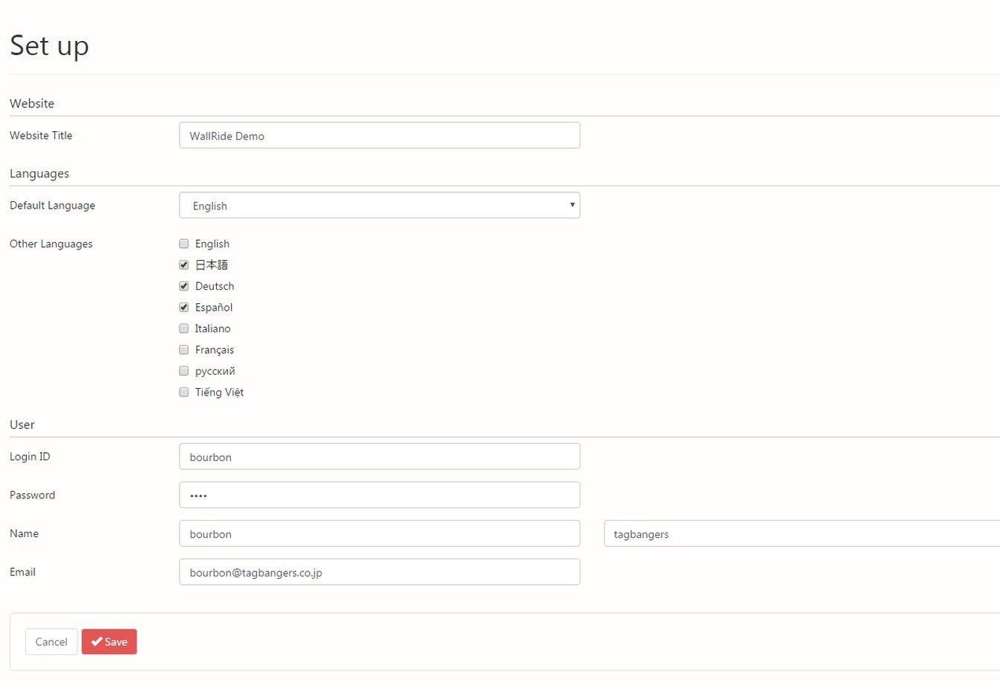

1 Intro
=====

1.1 What is WallRide?
---------------------
WallRide is a multilingual easy-to-customize open source CMS made by
Java, using [Spring Framework](http://projects.spring.io/spring-framework/), [Hibernate](http://hibernate.org/) and [Thymeleaf](http://www.thymeleaf.org/).  
WallRide focuses on sophisticated UI, simple and clean source code and
easy deploy to AWS BeansTalk(of course other servlet containers)  
We hope this CMS is loved by many developers of principles all over the world.

1.2 What is the strong point?
---------------------
**1. Multilingual CMS.** 
 
**2. Full-text search.**

**3. Affinity for AWS.**


2 Getting started
===============

WallRide has 2 packaging types; jar and war.

2.1 Installation requirements
-----------------------------
- Java8 or higher
- Database (MySQL or PostgreSQL)

2.2 Preparation
---------------
1. Create database for WallRide

2. Create wallride.home

```bash
mkdir <WALLRIDE_HOME>
mkdir <WALLRIDE_HOME>/config
cp wallride-core/src/main/resources/application.properties <WALLRIDE_HOME>/config
```
3. Set application.properties

Configure these properties in application.properties according to your environment.

Edit \<WALLRIDE_HOME\>/config/application.properties. 

Required properties are:

```properties
spring.datasource.url
spring.datasource.username
spring.datasource.password
spring.mail.host
spring.mail.port
spring.mail.default-encoding
```

Now, let's run the application. You can choose the way to run from the following;


2.3.1 Run from Maven Command Line
-------------------------
1. Check out sources

```bash
$ git clone git@github.com:tagbangers/wallride.git
```

2. Execute Command

```bash
$ cd wallride/
$ ./mvnw spring-boot:run -Pjar -Drun.jvmArguments="-Dwallride.home=file:<WALLRIDE_HOME>" 
```

3. Access URL below
  
http://localhost:8080/_admin/setup

4. See [4.1 Setup](#setup)

2.3.2 Run Executable jar
---------------------

1. Check out sources

```bash
$ git clone git@github.com:tagbangers/wallride.git
```
  
2. Execute command
  
```bash
$ cd wallride/
$ ./mvnw package -P jar && JAVA_OPTS="-Dwallride.home=file:<WALLRIDE_HOME>" ./wallride-bootstrap/target/wallride-bootstrap-X.X.X.jar
```
  
3. Access URL below
  
http://localhost:8080/_admin/setup

4. See [4.1 Setup](#setup)


2.3.3 Run from AWS Elastic Beanstalk
---------------------
1. Check out sources

```bash
$ git clone git@github.com:tagbangers/wallride.git
```

2. Build Project

```bash
$ cd wallride/
$ ./mvnw package -P war
```

the war file will be created in the directory below

```properties
./wallride-bootstrap/target/wallride-bootstrap-X.X.X.war
```
 
3. Create application.properties in S3
 
Configure items below in application.properties 
And set the value of jgroups 

```properties
jgroups.configurationFile=jgroups-ec2.xml
jgroups.s3.bucket={your-s3-bucket-name}

```
   
4. Setup AWS Elastic Beanstalk  

```properties
Tier: Web Server
Platform: Tomcat
```

5. Configure Environment properties  

```properties
Name: wallride.home
Value: s3://<WALLRIDE_HOME>
```

6. Upload war

7. Access URL below  
http://xxx.elasticbeanstalk.com/_admin/setup

8. See [4.1 Setup](#setup)
 
3 WallRide Home Directory
=======================
 
```text
wallride_home
+-- config
|   +-- application.properties
+-- media
+-- themes
    +-- default
       +-- resources
       |   +-- images
       |   |   +-- background.jpg
       |   +-- scripts
       |   +-- styles
       +-- templates
           +-- article
           |   +-- author.html
           |   +-- category.html
           |   +-- describe.html
           |   +-- index.html
           +-- error
           +-- page
           |   +-- describe.html
           +-- tag
           |   +-- index.html
           |   +-- post.html
           +-- user
           |   +-- login.html
           |   +-- password-reset1-entry.html...
           +-- google-analytics.html
           +-- index.html
           +-- layout.html
```
 
4 User guide
===============
4.1 Setup
-----------

After you launch the app, you will see this screen. 

[](../assets/images/setup.jpg)

This is the basic setting of the new website. You input title, default language, other languages to switch, and first user info.

WallRide is inspired by Wordpress, so if you are familiar with Wordpress you can start WallRide quickly relatively without difficulty.
"Article" in WallRide nearly equals to "Post" in Wordpress. (Post whose URL has datetime.)
The big difference between WallRide and WordPress is that WallRide has "Categories" and "Tags" for "Page" as well. 
It's because we have faced with some situation that we want to group "Articles" and "Pages" by common category or tag.   
For example, suppose that you want to make an event introduction page. Usually you start creating explanation of an event with "Page".
But sometimes we want to link latest articles related with the event to it.    

5 Designer guide
==============
 
5.1 Customize themes
----------------
 
WallRide has original themes for the guest site in it, but you can replace them by putting your sources in wallride.home. 
 
1. HTML
 
WallRide's template engine is thymeleaf. If you extend it, please refer to [Thymeleaf documentation](http://www.thymeleaf.org/documentation.html) as well.

Template for guest site

| URL                           |      outline                                           |  directory path        |
|-------------------------------|--------------------------------------------------------|------------------------|
| /                             | Index template                                         | /index.html            |
| /{language}/yyyy/mm/dd/{code} | Article description template                           | /article/describe.html |
| /category/{categoryCode}      | Article index template grouped by the category         | /article/category.html |
| /author/{authorId}            | Article index template grouped by the author           | /article/author.html   |
| /tag/                         | Tag index template                                     | /tag/index.html        |
| /tag/{tagName}                | Article index template grouped by the tag              | /article/index.html    |
| /search                       | Post search template                                   | /search.html           |
| /{pageCode}                   | Page template(index and description template are same) | /page/describe.html    |
 

WallRide customizable variables … choto matte kudasai.

**\#articles**

**\#posts**
 
**\#pages**
 
2. Resources

Place resource files under "resources" directory in wallride.home. You can refer them from html like this;

```html
<link rel="stylesheet" th:href="@{/resources/css/sticky-footer-navbar.css}" href="#" />
<script th:src="@{/resources/lib/jquery.lazyload.min.js}" src="#"></script>

```
 
6 Developer guide
===============
 
6.1 Overall architecture
--------------------
WallRide uses Spring Framework, Hibernate, and Thymeleaf.

6.2 Customize
---------
Thanks to [Spring Boot starters](http://projects.spring.io/spring-boot/) which WallRide uses and customizes, it is very easy to customize it with 3 steps.

1. Write pom.xml

```xml
<project xmlns="http://maven.apache.org/POM/4.0.0" xmlns:xsi="http://www.w3.org/2001/XMLSchema-instance"
		 xsi:schemaLocation="http://maven.apache.org/POM/4.0.0 http://maven.apache.org/xsd/maven-4.0.0.xsd">
	<modelVersion>4.0.0</modelVersion>
	<parent>
		<groupId>org.wallride</groupId>
		<artifactId>wallride-parent</artifactId>
		<version>1.0.0.M16</version>
	</parent>
	<groupId>com.example</groupId>
	<artifactId>example-blog</artifactId>
	<version>1.0.0.RELEASE</version>
	<packaging>jar</packaging>

	<properties>
		<start-class>com.example.Application</start-class>
	</properties>

	<dependencies>
		<!-- MySQL Driver -->
		<dependency>
			<groupId>mysql</groupId>
			<artifactId>mysql-connector-java</artifactId>
			<version>5.1.23</version>
		</dependency>
	</dependencies>
</project>
```

2. Create main class with @SpringBootApplication 

```java
@SpringBootApplication
public class Application extends SpringBootServletInitializer  {

	public static void main(String[] args) {
		SpringApplication.run(Application.class, args);
	}
}
```

That's it! Now you can start customize. 

3. In case of adding URL

```java
@SpringBootApplication
@WebGuestComponentScan(basePackageClasses = TestController.class)
@WebAdminComponentScan(basePackageClasses = DummyController.class)
public class Application extends SpringBootServletInitializer  {
	//run main class
}
```

4. In case of overriding existing Controller

5. In case of adding Service

```java
@SpringBootApplication
@ComponentScan(basePackageClasses = DummyService.class)
public class Application extends SpringBootServletInitializer  {
	//run main class
}
```

6. In case of adding Repository

```java
@SpringBootApplication
@EnableJpaRepositories(basePackageClasses = DummyRepository.class)
public class Application extends SpringBootServletInitializer  {
	//run main class
}
```

7. In case of adding Entity

```java
@SpringBootApplication
@EntityScan(basePackageClasses = Dummy.class)
public class Application extends SpringBootServletInitializer  {
	//run main class
}
```

6.3 Entities
--------
ER diagram

[](../assets/images/er-diagram.png)

6.4 About HA
--------
WallRide enables HA architecture by using infinispan. 

For more Details: chotto matte kudasai

7 What’s next
=============
WallRide is still milestone version but we are working hard for Release version.
Of course you can use WallRide with milestone one, try it out and give us more feedback!

8 Contribute
=============
WallRide github repository is [here](https://github.com/tagbangers/wallride).
If you want to contribute to a project and make it better, your help is very welcome.
PR is always welcome! Please note that to maintain the WallRide code simple and clean,
follow the instruction below.   

1. Fork the project into your personal space on WallRide.
2. Create a feature branch, branch away from master. Usually from develop branch. 
3. Write code (if possible, write test code as well)
4. Add your changes to the CHANGELOG if possible
5. If you have multiple commits please combine them into one commit by squashing them if possible
7. Push the commit(s) to your fork
8. Submit a pull request (PR) to the develop branch
9. The PR title describe the change you want to make
10. When writing commit messages please write like the current commit we make if possible.

If you have any questions, create an issue on github. In the future we might switch to use other issue management services like JIRA, or chat with gitter,
but as for now, let's start from simple github issues.


  
  